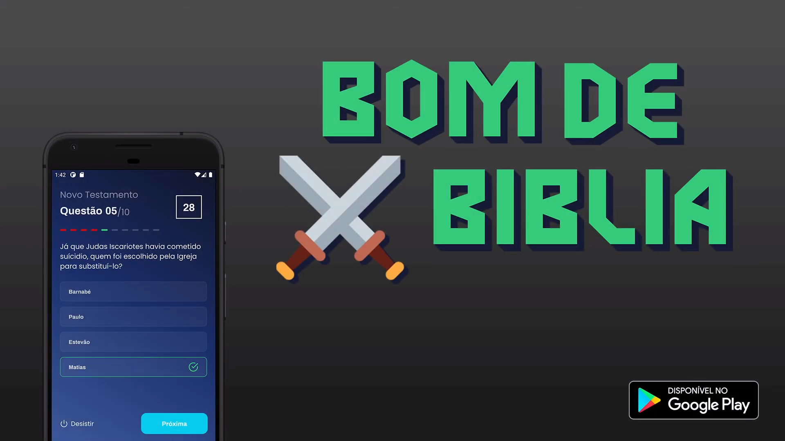

<h1 align="center">
Bom de Bíblia - Open Quiz :exclamation::question:
</h1>

<p align="center">
<a href="https://www.linkedin.com/in/danielfercruz/">

</a>


  
</p>
<p align="center">
  <a href="#-project">Project</a>&nbsp;&nbsp;&nbsp;|&nbsp;&nbsp;&nbsp;
  <a href="#-some-technologies">Technologies</a>&nbsp;&nbsp;&nbsp;|&nbsp;&nbsp;&nbsp;
  <a href="#-how-to-use">How to use</a>&nbsp;&nbsp;&nbsp;|&nbsp;&nbsp;&nbsp;
  <a href="#-how-to-contribute">How to contribute</a>&nbsp;&nbsp;&nbsp;
</p>

## 💻 Project

<p align="center">
 

After 4 months of study from scratch, I published my first app on the Play Store and now I publish the open source. 
This project is a bible quiz app, in this app I opted for the offline first methodology, 
if the user has internet connection the app check for questions/categories updates using firebase realtime database, 
to check for code updates uses CodePush and to persist offline data I used RealmDB.

<strong>* Only for Android, 'cause i haven't a mac :(</strong>

If u want to know more about visit the playstore link: https://play.google.com/store/apps/details?id=com.danielfcruz.bomdebiblia
</p>

## 🔧 Some Technologies

This project was developed with the following technologies:

- [React-Native][react-native]
- [TypeScript][typescript]
- [Styled-Components][styled-components]
- [CodePush][codepush]
- [Firebase][firebase]
- [Firebase/Admob][firebase/admob]
- [Redux][redux]
- [Redux-Saga][redux-saga]
- [RealmDB][realmdb]
- [ESLint][eslint]

## ❓ How To Use

To clone and run this application, you'll need [Git](https://git-scm.com), [Node.js][nodejs] e [Yarn].
From your command line:

### Simple install

```bash
# Clone this repository
$ git clone https://github.com/daanielcruz/bomdebiblia-openquiz

# Go into the repository
$ cd bomdebiblia-openquiz

# Install dependencies
$ yarn install

# Start the bundler
$ yarn start

# Do the Android build
$ yarn android

# The RN project should have open.
```

## 🤔 How to contribute

- Make a fork;
- Create a branck with your feature: `git checkout -b my-feature`;
- Commit changes: `git commit -m 'feat: My new feature'`;
- Make a push to your branch: `git push origin my-feature`.

After merging your receipt request to done, you can delete a branch from yours.

Made with ♥ by Daniel Cruz :wave: [Get in touch!](https://www.linkedin.com/in/danielfercruz/)

[react-native]: https://reactnative.dev/
[nodejs]: https://nodejs.org/en/
[typescript]: https://www.typescriptlang.org/
[styled-components]: https://styled-components.com/
[yarn]: https://yarnpkg.com/
[vs]: https://code.visualstudio.com/
[codepush]: https://github.com/microsoft/react-native-code-push
[firebase]: https://firebase.google.com/
[firebase/admob]: https://rnfirebase.io/admob/usage
[redux]: https://redux.js.org/
[redux-saga]: https://redux-saga.js.org/
[realmdb]: https://realm.io/
[eslint]: https://eslint.org/
[vceditconfig]: https://marketplace.visualstudio.com/items?itemName=EditorConfig.EditorConfig
[vceslint]: https://marketplace.visualstudio.com/items?itemName=dbaeumer.vscode-eslint
[prettier]: https://marketplace.visualstudio.com/items?itemName=esbenp.prettier-vscode
