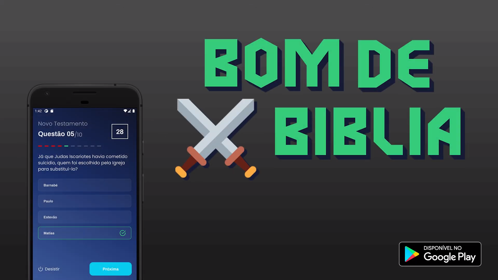

<h1 align="center">
Bom de Bíblia - Open Quiz :exclamation::question:
</h1>

<p align="center">
<a href="https://www.linkedin.com/in/danielfercruz/">

</a>


</p>
<p align="center">
  <a href="#-projeto">Projeto</a>&nbsp;&nbsp;&nbsp;|&nbsp;&nbsp;&nbsp;
  <a href="#-algumas-tecnologias">Tecnologias</a>&nbsp;&nbsp;&nbsp;|&nbsp;&nbsp;&nbsp;
  <a href="#-como-iniciar">Como iniciar</a>&nbsp;&nbsp;&nbsp;|&nbsp;&nbsp;&nbsp;
  <a href="#-como-contribuir">Como contribuir</a>&nbsp;&nbsp;&nbsp;
</p>

## 💻 Projeto

<p align="center">
 

Depois de 4 meses de estudo do zero, eu publiquei meu primeiro aplicativo na Play Store: Quiz da biblia.
Neste aplicativo eu optei pela metodologia "offline first": Se o usuário tiver conexão a internet, é checado novas questões/categorias acessando o "firebase realtime database",
para checar por atualizações no código, é usado o CodePush, e para persistir dados offline é usado o RealmDB.

<strong>* Somente para android</strong>

Se você quiser ver mais sobre, visite-o na [Play Store][playstore].

</p>

## 🔧 Algumas tecnologias

Este projeto foi desenvolvido com as seguintes tecnologias:

- [React-Native][react-native]
- [TypeScript][typescript]
- [Styled-Components][styled-components]
- [CodePush][codepush]
- [Firebase][firebase]
- [Firebase/Admob][firebase/admob]
- [Redux][redux]
- [Redux-Saga][redux-saga]
- [RealmDB][realmdb]
- [ESLint][eslint]

## ❓ Como usar

Para clonar e iniciar essa aplicação, você precisará do: [Git](https://git-scm.com), [Node.js][nodejs] e [Yarn].
Em sua linha de comando:

### Simple install


```bash
# Clone o repositório
$ git clone https://github.com/daanielcruz/bomdebiblia-openquiz

# Entre no diretório
$ cd bomdebiblia-openquiz

# Instale as dependências
$ yarn install

# Inicie o servidor
$ yarn start

# Inicie o Android
$ yarn android

# O projeto deverá ser aberto.
```


## 🤔 Como contribuir

- Faça um fork;
- Cria uma branch com sua nova feature: `git checkout -b my-feature`;
- Comite suas mudanças: `git commit -m 'feat: My new feature'`;
- Faça um push em sua nova brach: `git push origin my-feature`.
- Crie seu Pull Request.

Caso suas alterações sejam aceitas, você poderá deletar seu fork.

Feito com ♥ por Daniel Cruz :wave: [Entre em contato!](https://www.linkedin.com/in/danielfercruz/)

[react-native]: https://reactnative.dev/
[nodejs]: https://nodejs.org/en/
[typescript]: https://www.typescriptlang.org/
[styled-components]: https://styled-components.com/
[yarn]: https://yarnpkg.com/
[vs]: https://code.visualstudio.com/
[codepush]: https://github.com/microsoft/react-native-code-push
[firebase]: https://firebase.google.com/
[firebase/admob]: https://rnfirebase.io/admob/usage
[redux]: https://redux.js.org/
[redux-saga]: https://redux-saga.js.org/
[realmdb]: https://realm.io/
[eslint]: https://eslint.org/
[vceditconfig]: https://marketplace.visualstudio.com/items?itemName=EditorConfig.EditorConfig
[vceslint]: https://marketplace.visualstudio.com/items?itemName=dbaeumer.vscode-eslint
[prettier]: https://marketplace.visualstudio.com/items?itemName=esbenp.prettier-vscode
[playstore]: https://play.google.com/store/apps/details?id=com.danielfcruz.bomdebiblia
